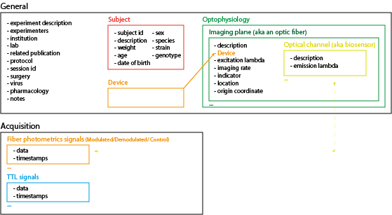
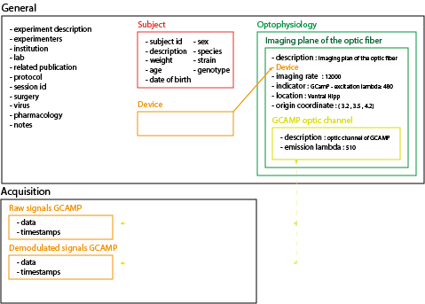
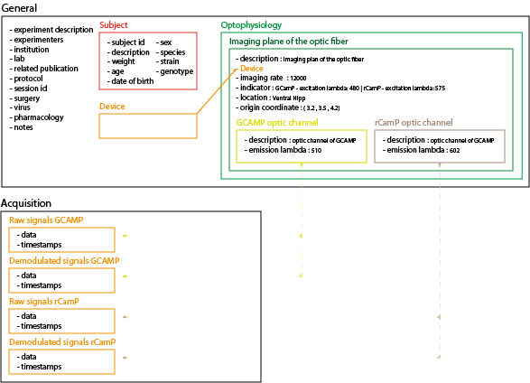
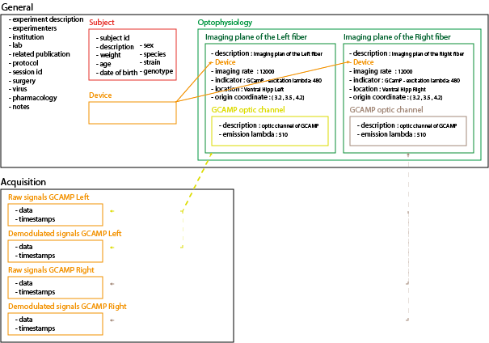
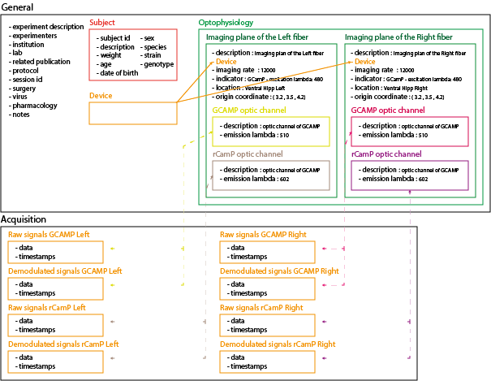
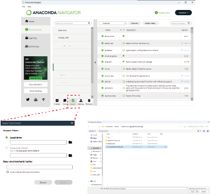

# NWB File format for Fiberphotometry data

This github repositorie contains all the function and explication about how to use and create NWB file for fiberphotometry experiments that comes from differents recording system. The objective is to unify the data storing process and analysis of differents type of data.


## What is NWB

NWB file format is the core component of the Neurodata Without Border (NWB) project. This format is designed to store optical and electrical physiology data with informations about the experiments design and animals used in it. This fomrat is both understandable by humans as well as accessible by programmatic interpretation. 
This format is based on HDF5 format for storing data and use a structure that look like a folders inside folder as you can find in our traditionnal computer. 
for more informations : https://nwb-schema.readthedocs.io/en/latest/format_description.html

## How to open and read NWB file
NWB file can be open and read with several tools:
- Classical HDF5 file viewer : You can use program or anything that can open an HDF5 file to see the contents of your NWB file.  
Ex: https://myhdf5.hdfgroup.org/
- In Python :  You can use the pynwb module (https://pynwb.readthedocs.io/en/stable/) to read and access data in your NWB file. 
- In MatLab : You can use the MatNWB interface (https://neurodatawithoutborders.github.io/matnwb/) to read and access data in your NWB file.

## Why using the NWB format 
The NWb file format is a based on a common file architecture (HDF5) that allow to store your data but also the meta-data of your experiments in a simple logic way. It can be easyly readable with various tools, and contains most of the informations needed to understand what was the objectives of the recordings stored in the file.  
The format consist of several general contanier (see them like folder in your computer) that can store other contanier or differents type of data (Text description, Numbers, Array of Numbers, Images/Video etc...).
The main container that every file posses are: 
- __general__ : This container contain all the information about the general design of your experiment.  
                It also posses a container named __subject__ that  hold the information about the animal that was recorded. 
- __acquisition__ : This container contains all the different raw data you acquired in your session.  
(ex: raw GCamP signal, TTL data, etc...)
- __analysis__ :   This container contains all the different data that you obtained from executing analysis on your raw data.  
(ex: dF/F of a GCamP signal, ZScore of this signals etc...) 

## How is structured our NWB file to stored informations related to Fiberphotometry acquisition
In fiberphotometry experiments, severals types of data can be collected depending of the design and objectives of the experiments: 
- __Light signals from your differents indicators__ : this signals recorded in volts (V) correspond to the quantitie of photon detected by your photodetector at a certains time points. This data are two dimensionnals arrays with the first one corresponding to the timestamps and the second one corresponding to the light detected at this time point. You can collect severals of this signals on the same animals, on one or severals optic fibers implanted.  

- __Transitor-to-Transistor Logic (TTL) data__ : this signals correspond to binary event (True/False or 0/1) recorded in parralell of your Light singals. most of the time this signals comme from extrnal input that you can connect to your acquisition system, and are used to synchronise devices between them (ex: a camera and your photometric recordings) or to records special events (ex: animals stop moving, animal start grooming, problem observed when recording, etc...). This data are also a 2 dimensionnal array, with the first one corresponding to the timestamps of the event and the second to it's value (0 or 1).

To understand what this signals represents, you also need to store informations about differents metadata (ex: smapling frequency, optic fiber diameter, etc...).

Our NWb file for fiberphotometric recordings  are structured as follow to contains all this differents data:  


- __General__: this container hold informations about the experiment design.
    - experiments_description : description of what you have done in your experiment and recording
    - experimenters : who have done the experiment
    - institution : which instituions you have done your data acquisition
    - lab : which laboratory you have done your data acquisition
    - related_publications : doi of the publication where the data is published
    - protocol : the internal protocol name used foir the data acquisition
    - session_id : 
    - surgery : description of the surgery you realized on your animals
    - virus : the differents virus you and in wich region your express them in your experiments
    - pharmacology : description of the differents pharmacological compounds you used in your experiments
    - notes : any notes about the recording and experiments
    - __device__ : Simple container that hold severals informations about the acquisition system used to record your data. 
    - __subject__ : This container hold informations on the animal you recorded the data:
        - subject_id : identifier of the animals you used 
        - description : note about the animal, can also contains tattoo number of the animals
        - weight : weight of the animal at the moment of the recording
        - age : age of the animal at the moment of the recording
        - date_of_birth : birth date of the animal
        - sex 
        - species 
        - strain  
        - genotype 

- __The fiber photometric recordings__ : are stored in the acquisition and named to correspond to the optical channel and imaging plan that are link to it. 
- __The TTL signals__ : are stored in the acquisition and named accordingly. 
- __Imaging Plan__: This container represent an optic fiber  used to record signals.  
    It's defined by severals charateristic: 
    - name : correspond to the name you give to the optic fiber 
    - description : description about the optic fiber and it's diameter and numerical aperture
    - imaging rate : sampling rate used to record you fiberphotometric signal
    - indicator : the biosensor/ indicators recorded with this optic fiber, the excitation lambda associated (you can have severals biosensors on the same optic fiber)
    - location  the brain region where you implanted your optic fiber
    - origin_coords : the stereotaxic coordinate of your optic fiber
    - optical channel : link to the container that will store info on the differents emissions lambda associated with biosensor used (one per biosensors)
    - device : link to the container that contains informations about the acquisition system you used to record this signals

- __Optical Channel__: Simple container that hold the informations about the excitation lambda used to record a biosensors on a fiber. You have one optical channel per biosensor per optic fiber. 

Exemple of file structure for severals type of recordings:  
- Only one signals on one optic fiber :  

- Two signals on one optic fiber :  

- Two optic fiber, with one signals for each :  

- Two optic fiber, one with one signals and one with two signals :  


## How to generate the NWB file
To convert your data from the format you recorded them to the NWB file format, you can use several methods. 
The two first (GUI converter & Excel_converter script) are based on a excel file that you fill with the informations to automatically create one or several NWb file (one per animal recorded). The third one use several python function in a script that allow you to directly manipulate and edit the contnent of the file as you create them. This last method can be useful if you need to add informations or data that are not defined in this file structure. 

### Setting up the python environnement
To be able to run this differents method, you need to setup a python environment.
Easiest way is to use the Anaconda distribution.
- Install Anaconda (https://www.anaconda.com/download)
- Download the envirronement specification ( [Environnement_config.yaml](../../Environnement_config.yaml) )
- Download or branch this repositorie
- Open anaconda navigator
- In the environnements tab, click on import 
- In the local drive tab, select the environment you downloaded
- Click on import, anaconda will automatically create and setup a new virtual environment that contains all the librairies need to run the differents methods  

    
### Method 1 : Use the GUI converter
- In the home page of anaconda, select the virtual environnement "NWB_for_fiberphotometry"
- Open the anaconda prompt
- Run the command line : python <path\to\the\gui_converter.py>
- A GUI will appear, you can now use the file browser to select your excel file that describe your experiment
- Click on submit
- The conversion will start, you can follow the process in the console
- When finished, you can run a new conversion or click on cancel to quit the GUI
- The NWB file will be located in a Files folder in the same folder as your excel configuration file
(exemple in the [Example_convert_from_Excel.py](Example_convert_from_Excel.py) script)

### Method 2 : Use the Excel_converter python script
- Create a new python script
- Import the function
    ```python
    from  fiberphotometry_tools.NWB_builders.convert_from_excel import convert_excel_to_nwb
    ```
- This function take a filepath to  a [setup_NWB.xlsx](<../GUI Interface/Converter_to_NWB/Setup_NWB.xlsx>) as file parameter and the directorie where you want to save the NWB file as save_direc parameter

### Method 3 : Directly use the Python converter
- use the function **create_NWB** from the module 
    ```python
    from  fiberphotometry_tools.NWB_builders.builder_photometry import create_NWB
    ```
- this function take several dictionnary as input:
    - general_info : this "simple" dictionnary contain all the informations about the experimental design and experimenters that have done it
    ```python
    general_info = { "session_description":"Mouse exploring an open field",  # required
                     "identifier":str(uuid4()),  # required
                     "session_start_time":session_start_time,  # required
                     "session_id":"session_1234",  # optional
                     "notes": "Note about the exp", #optional
                     "protocol": "PAD-2024-01", #optiona
                     "lab":"Bag End Laboratory",  # optiona
                     "institution":"University of My Institution",  # optional
                     "experimenter":["Baggins, Bilbo",],  # optional
                     "experiment_description":"I went on an adventure to reclaim vast treasures.",  # optional
                     "related_publications":"DOI:10.1016/j.neuron.2016.12.011",  # optional
                     "keywords":["Pain", "Depression"],# optional
                     "virus": "VTA: Chr2-Floxed",# optional
                     "surgery":"animal cuffed and injected by stereotaxy",# optional
                     "pharmacology":"Description of drugs used, including how and when they were administered. Anesthesia(s), painkiller(s), etc., plus dosage, concentration, etc.",
                     "source_script" :"Script file used to create this NWB file",# optional
                     "source_script_file_name":"Name of the source_script file",# optional
                     }
    ```
    - animal_info : this dictionnary contain the information on the animal on wich the recordings was done
    ```python
    animal_info ={"subject_id":"001",  
                  "description":"mouse 5",
                  "sex":"M",
                  "age":"P90D",
                  "weight": "0.02 Kg",
                  "genotype":"DAT+/-",
                  "strain":"DAT-Ires-CRE",
                  "species":"Mus musculus",
                  "date_of_birth": datetime(2018, 4, 25, 2, 30, 3, tzinfo=tz.gettz("US/Pacific")) 
        }
    ```
    - channel_info : this is the most important dictionnary, it is used to define what was recorded on your animal.  
        Inside it there 2 dictionnaries:  
        * Device : that contains the information on the system used to record.  
        * channels :  that describe what has been recorded on your animals. Inside there one dictionnary per optic fiber recorded on the animal.  
            * for each optic fiber you define it's information and in the dictionnary signals wich signals you have recorded  
            * in each signals, you idefine the raw and demodulated data by the name of the signals recorded in the dataset / dataframe

    ```python
    channel_info = {"Device": {"Name": "Charlet's Team Doric", 
                                "Description": "Test description",
                                "Manufacturer": "DORIC" }, 

                    "channels": {"Fiber_1":{"imaging rate": 12000,
                                            "indicator": "GCamP",
                                            "location": "VTA",
                                            "coordinate": (3.5, 0.4, 4.5),
                                            "fiber diameter": 400, 
                                            "fiber NA": 0.59,

                                            "signals": {"GCamP": {"excitation":480.0, 
                                                                  "emission":510.0,
                                                                  "data":{"raw_signal":"AIn-1 - Raw",
                                                                          "demodulated_signal":"AIn-1 - Dem (AOut-1)",
                                                                          }
                                                                },
                                                        "rCamP": {"excitation":470.0, 
                                                                  "emission":500.0,
                                                                  "data":{"raw_signal":"AIn-1 - Dem (AOut-1)",
                                                                         "demodulated_signal":"AIn-1 - Raw", 
                                                                         }
                                                                }
                                                        },
                                                }
                                    }
                        }
    ```
    - TTL_info  : this dictionnary is used to define the digital input you used to mark event in your data (most of the time it's TTL signals, ex: start of procedure, animal is grooming, animal is in a specific zone of the apparatus etc.). For each signal you used, You ned to attribute a name (ex: "Video sync") and then define it's information in a sub-dictionnary. This sub-dictionnary use 2 entry : 
        * data : correspond to the name of the data in your signals.
        * description : a simple description of what the signals is used for and how it is encoded. 

    
    ```python
    TTL_info = {"Video Sync":{"data":"AOut-1",
                              "description": "Channel used to synchronize video recording, 1 TTL pulse of 100ms at start of recording"
                              },
               }  
    ```