# GUI Converter Setup and Usage
This folder contain on python script that you can run to open Graphic Interface to convert your file to the NWB file format. This GUI uses an [excel template file](#What-compose-the-excel-file) to export correctly the metadata into your NWB file.

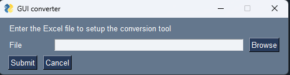

The GUI will create a folder named **"Files"** in the same directory where your setup_NWB.xlsx is located. This folder will contain the exported NWB file.

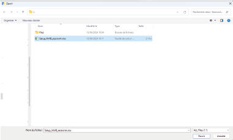
## What compose the excel file
The excel template file (**Setup_NWB.xlsx**) is composed of several tabs that you need to fill before the export:
- __Animals_info__ : This is the tab where you input information about the animal(s) recorded and indicate the name of the file(s) associated with the recording
- __General_info__ : This tab contains the information about the general design of your experiment
- __Device_info__ : This small tab is use to define the equipment used for the recordings
- __Fiberphotometry_signals__ : This tab is used to define the properties of the different photometric signals recorded
- __TTL_info__ : This tab allow you to define trigger ("TTL") or diverse events signals recorded with your setup.

[!WARNING]  
**It's important that you don't edit the file organisation to allow the GUI to works properly (Don't move or add any row or columns inside the file). The excel file is locked so you can only edit the part you need to fill.** 

[!NOTE]  
This is still an on-development tool, if any bug or error appears create an issue on GitHub or send an email to paderrien.inci@gmail.com

## Animals_info tab
This tab of the excel contains all information about the different animal recorded over a session and the link to the file where the raw data are stored.
Each line represent an animal where you can fill several column about the animal:

- __subject_id__ : This represent the name or identifier of the animal

- __description__ : This field is used to input any information or comments about the recording.

- __age__ : the age of the animal at the moment of the recording  
 (in day post partum, ex: 30 days = P30)

- __date_of_birth__ : in the format dd/mm/yyyy

- __weight__ : in grams

- __genotype__ : the genotype of the animal  
 (ex: CRE+/-)

- __sex__: Male / Female / Other

- __strain__ : the specific strain of the animal  
 (ex: Wistar, Sprague-Dawley, C57BL6J, DAT-cre etc...)

- __species__ : mice, rat etc...

- __Animal number__ : this special field is used if you have several animal recorded simultaneously in one file. You can attribute a specific number to each animal to separate them. In this case, each animal has a row, but the column file_name (see below) will point to the same file

- **Comment** : Any additional comment about the recording (animal's name, recording tag or short condition). This will be added to the filename so keep it short. spaces will be trimmed.

- __File_name__ : the file name inside the folder where you stored your data (the file name must contain the extension)
 (ex: file.doric, file.csv etc...))

- __File Directory__ : The folder where you have all your data for the session  
 (it must not contain other sub_folder before the file data)

   ***Exported file name will be ***
   
   ***"subject_id"+"YYYY-MM-DD"+"animal_number"+"_comment"+".nwb". ***
   
   *** If animal number and/or comment sections are empty, they will not appear in the file name***
   
   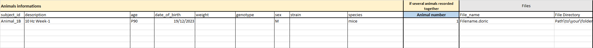

## General_info tab
This tab is used to input the information about the session and experiment design related to all the animals specified in the Animals_info tab. 
This tab is subdivided in 3 part: 

- __The General info__: That contain information on the experiment
    - __session_description__: A text description of what you have done in your session
    - __session_start_time__ :  at what date/time did you start the session. If left empty the value is obtained from the file. format is YYYY/MM/DD HH:mm:ss
    - __session_id__ :  a name/identifier for the session
    - __notes__: any notes about the session
    - __protocol__ :  Protocol number (if any)
    - __lab__ : the name of laboratory were the recording has been done
    - __institution__ : the name of the institution were the recording has been done
    - __experiment description__ : a full description of what you have done and what are the objectives of your experiments. This is used to understand what you have done and can integrate a description of the differente stimulations/experimental protocole you do. 
    - __related publication__ : the link or doi of the publication
    - __virus__ : the different virus you used in wich brain region in your experiment  
     (ex : NAc: dLight1.2, etc.)
    - __surgery__ :  a small description of the differents surgery realized on the animals, and what it induced if needed
    - __pharmacology__ :  the different pharmacological compound you used, and a description of there effects if needed

      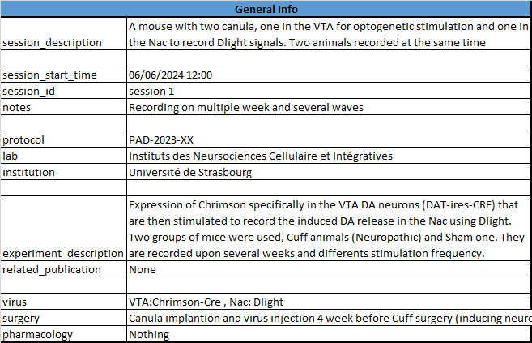

- __Experimenters__ : where you filled a row with each first and last name of the experimenters implicated on the recording. 
- __Keywords__ : You can input some keyword inside the file to handle tagging and rapid classification of it afterward (ex: NAc, Depression, Pain, Pilot experiment, etc.)

    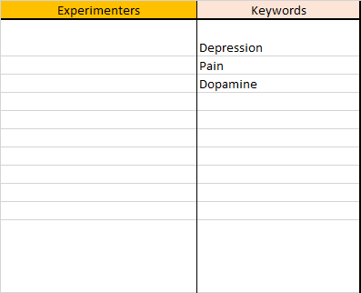
## Device_info tab
This really simple tab is used to get the info on the setup you used.
- __Name__ : The name of your hardware setup
- __Manufacturer__ :  manufacturer, or your laboratory name for custom setup
- __Description__ : a description of the properties of the setup, especially its particularity and modification

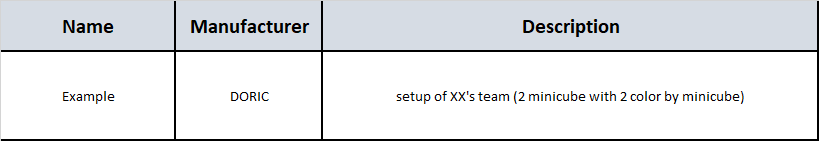

## Fiberphotometry_signal tab
Use this tab to define the location of the optic fiber, their properties and what type of signals you recorded on them. Each column represent a optic fiber.
This tab is separated in two zone: 

- ***The Fiber info zone*** : that represent the optic fiber property and location.
    - __Fiber name__ : A name to describe the fiber (don't use any space in the name, use "_")
    - __Imaging rate__ : the sampling frequency you used in Hz
    - __indicator__ : the different indicator you recoreded with this fiber
    - __location__ : the region where you implanted the fiber
    - __AP__ : the antero-posterior distance to the bregma
    - __ML__ : the medio-lateral distance to the bregma
    - __DV__ : the dorso-ventral distance to the brain
    - __Fiber diameter__ : the diameter in mm
    - __fiber NA__ : the numerical aperture of the fiber
    - __Animal number__ : if you have several animal recorded inside the same file, Use this row to define which fiber corresponds to which animal

      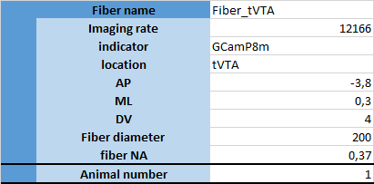

- **Signal(s) section**: Each colored subsection represent one recorded signal (i.e. one color. It is not the number of laser, but the number of recorded output signals, which may or may not be different). Each signal is defined by several parameters.
  
    - __Signals n__ : the number of signals recorded
    
    - **Name** : The name of signals recorded (don't use any space in the name, use "_")
    
    - __excitation__ : of the biosensor (in nm)
    
    - __emission__ : of the biosensor (in nm)
    
    - __raw signal__ : the channel name of the modulated signals recorded by your setup
    
    - __demodulated__ : the channel name of the demodulated signals recorded by your setup
    
       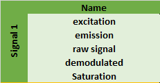
    
    You need to enter the exact name of your RAW and demodulated signals, for each signal you recorded. 
    
- <u>Example 1:</u> If you record GCaMP on an optic fiber, you need to define 2 signals
  
    * One green signal (for GCaMP)
    * One isosbestic signal for GCaMP. 
    
- <u>Example 2:</u> If you record TdTomato and GCaMP on an optic fiber, using a single laser, you need to define 3 signals
  
    * One red signal (for TdTomato)
    * One green signal (for GCaMP)
    * One isosbestic signal for GCaMP. 
    
- <u>Example 3:</u> If you record RCaMP and GCaMP on an optic fiber, using a single laser, you need to define 3 or 4 signals
  
    * One red signal (for RCaMP)
    * One isosbestic signal for RCaMP if you have it.
    * One green signal (for GCaMP)
    * One isosbestic signal for GCaMP. 

## TTL_info tab

This tab is used to define the information about the different triggers (TTL) signals you recorded.
Each column represents a TTL channel you recorded, with several parameters: 

- __TTL_Name__ : how you want to name the TTL inside the file (don't use any space in the name, use "_")
- __data__ : The channel name of this TTL in your file data.
- __description__ : a text description of what this signal represents (can be really useful to reanalyse the data after it)
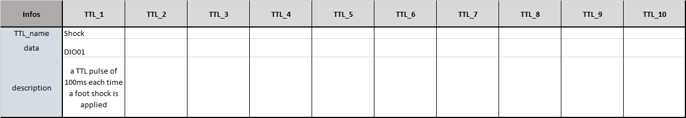

# Troubleshooting

Always inspect the console log after export

## Wrong channel name

If the channel indicated in the xlsx file does not exist, the script will ouput a message together with a list of valid names

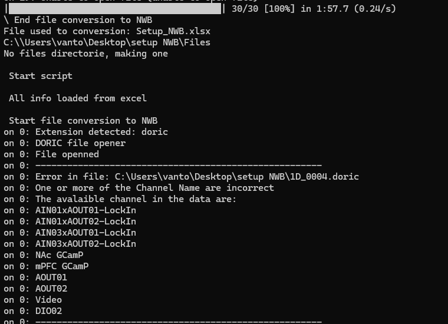

## File missing

If you didn't indicate the correct filename or folder, you will see the following message

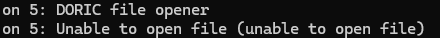