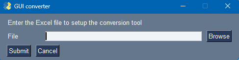

# Setup

## Setup the NWB exporter 

> **Note for Matlab Users: If you do not plan to use python, you can skip the entire python/Conda setup process described below, and directly use the binaries (GUIConverter.exe for windows user and GUIConverter.app for mac) to create NWB files and switch to matlab**

> **Note for Python Users : Even if using python for analysis, you can use directly the binaries (GUIConverter.exe for windows user and GUIConverter.app for mac) to create NWB files**

To use our conversion tools, you need to have Python3 installed. 

To facilitate your installation, we recommend using Anaconda. Once anaconda is installed, create a new environment, either by using Anaconda Navigator, or in your command prompt (see below).

### Setting Up the Conda Environment NWB

To create and configure the **NWB** environment using Conda, follow these steps:

### Create the Conda Environment
Open a terminal and run:

```bash
conda create --name NWB python=3.11.5 -y
```

This creates a new Conda environment named **NWB** with Python **3.11.5**.

### Activate the Environment
Activate the newly created environment:

```bash
conda activate NWB
```

### Install Dependencies from [NWB_environment.yaml](NWB_environment.yaml)
Ensure you have the YAML file [NWB_environment.yaml](NWB_environment.yaml) in your working directory, then install the dependencies:

```bash
conda env update --file "path\to\the\github\repo\NWB\NWB_environment.yaml" --prune
```

The `--prune` flag ensures that only the specified dependencies are installed, removing any unnecessary packages.

### Verify Installation
To confirm that the environment is set up correctly, check the installed packages:

```bash
conda list
```

You can now use the **NWB** environment for your project.

## Setup the libraries for Fiberphotometry analysis in python

You need additional librairies to use our tools and manipulate NWB files. To add the missing librairies using

```bash
conda env update --name NWB --file Fiber_Environnement_config.yaml --prune
```

## Setup the libraries for Electrophysiology analysis in python

same as above, but additionally run

```bash
conda env update --name NWB --file Ephy_Environnement_config.yaml --prune
```

## Setup the MatNWB to load NWB files in MATLAB

~~~markdown
To load NWB files in MATLAB, you can follow the installation instructions here: [MatNWB Documentation](https://matnwb.readthedocs.io/en/latest/).

* You can either get the latest version using `git clone`:

  ```sh
  git clone https://github.com/NeurodataWithoutBorders/matnwb.git
~~~

or

- Download a stable release (recommended) by getting the zip file from [MatNWB Releases](https://github.com/NeurodataWithoutBorders/matnwb/releases).

- Add it to your MATLAB path:

  ```matlab
  addpath(genpath('path_to_matnwb'));
  savepath; % for permanent storage
  ```


## Load and Plot a Single Fiber Photometry Channel

To plot a specific fiber photometry signal stored in an NWB file:

```matlab
% Load NWB file
nwb = nwbRead('your_file.nwb');

% Retrieve the fluorescence signal for NAc Recording
fp_data = nwb.acquisition.get('demodulated_signal Dlight_signal Nac_Recording');

% Extract time and fluorescence data
timestamps = fp_data.timestamps.load();
fluorescence_signal = fp_data.data.load();

% Plot the data
figure;
plot(timestamps, fluorescence_signal);
xlabel('Time (s)');
ylabel('Fluorescence Intensity');
title('Fiber Photometry Signal - NAc Recording');
grid on;
```


## Plot Multiple Fiber Photometry Channels

To visualize multiple fiber photometry signals from different channels in the NWB file:

```matlab
% Load NWB file
nwb = nwbRead('your_file.nwb');

% List all available acquisition channels
channels = nwb.acquisition.keys;
num_channels = length(channels);

% Create subplots for each channel
figure;
for i = 1:num_channels
    % Get the channel data
    fp_data = nwb.acquisition.get(channels{i});
    
    % Extract time and fluorescence data
    timestamps = fp_data.timestamps.load();
    fluorescence_signal = fp_data.data.load();
    
    % Plot in subplot
    subplot(num_channels, 1, i);
    plot(timestamps, fluorescence_signal);
    xlabel('Time (s)');
    ylabel('Fluorescence Intensity');
    title(['Fiber Photometry Signal - ', channels{i}]);
    grid on;
end
```


# Convert a file

Start the Converter by 

- either running the binary file (GUIConverter.exe for windows user and GUIConverter.app for mac)

- by running from spyder the file path\to\the\github\repo\NWB\GUI\Fiberphotometry\GUI_converter.py

  Make sure that the GitHub folder was added to your python path by selecting the PYTHONPATH manager

  

  

* by doing the same, but directly in the console 

```bash
(base) C:\Users\vanto>conda activate NWB

(NWB) C:\Users\vanto>set PYTHONPATH= path\to\the\github\repo

(NWB) C:\Users\vanto>python "path\to\the\github\repo\NWB\GUI\Fiberphotometry\GUI_converter.py"
```

if you see the following GUI, you can proceed to the import. For this, refer to the [dedicated import tutorial](GUI/Fiberphotometry/README.md)

