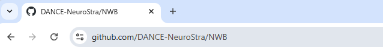
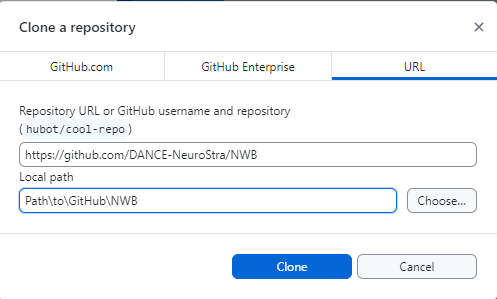
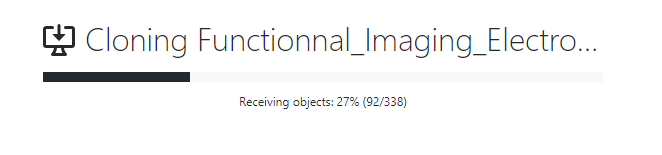

# Prequisites

## Training in Python

If you don't know where to start to learn python, and the differents libraries/frameworks related to data analysis, you can find some underneath

### In French : 

 - **MOOC Python** (9 week) : That cover all the basics (6 first weeks) and an introduction to the data science ecosystem (week 7).  
   https://lms.fun-mooc.fr/courses/course-v1:UCA+107001+session02/eb326b60bec3461ba2621fd4d6bd95b8/

### In English :

# Setup Github repo

You need to have git and GitHub desktop installed on your computer. Ideally, you need a GitHub account.

Once ready Go to the webpage of the repo https://github.com/DANCE-NeuroStra/NWB

Clone the repo either by copying the link

https://github.com/DANCE-NeuroStra/NWB.git

or click on Open with Github desktop

In GitHub Desktop, chose where your code will be located

Now it should be cloning the repo

 

Now your repo should be available.

# Convert your first dataset

You need to have some Fiberphotometry data available. For example, for a doric recording, you should have at least one *.doric file. 